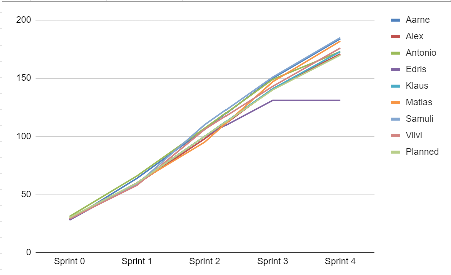

# Team 8 - Kasipallot

# Table of Contents
- [Team 8 - Kasipallot](#team-8---kasipallot)
- [Table of Contents](#table-of-contents)
  - [Project Review 1](#project-review-1)
    - [Product Vision](#product-vision)
    - [Product Backlog](#product-backlog)
    - [Sprint Backlog of the current Sprint](#sprint-backlog-of-the-current-sprint)
    - [Process Overview](#process-overview)
      - [Project schedule and effort](#project-schedule-and-effort)
      - [Recurring events of the Sprints](#recurring-events-of-the-sprints)
        - [Sprint Planning](#sprint-planning)
        - [Sprint Review](#sprint-review)
        - [Sprint Retrospective](#sprint-retrospective)
        - ["Daily” Scrums](#daily-scrums)
        - [Teamwork sessions](#teamwork-sessions)
        - [Testing and other quality assurance practices](#testing-and-other-quality-assurance-practices)
        - [Communication channel(s)](#communication-channels)
        - [Backlog management](#backlog-management)
        - [Time tracking](#time-tracking)
        - [Version control](#version-control)
    - [Definition of Done](#definition-of-done)
    - [Technical overview](#technical-overview)
  - [Project Review 2](#project-review-2)
    - [Product Vision](#product-vision-1)
    - [Product Backlog](#product-backlog-1)
    - [Sprint 2 backlog](#sprint-2-backlog)
    - [Sprint 3 backlog](#sprint-3-backlog)
    - [Sprint 4 backlog](#sprint-4-backlog)
    - [Velocity Chart](#velocity-chart)
    - [Process Overview](#process-overview-1)
      - [Project schedule and effort](#project-schedule-and-effort-1)
      - [Recurring events of the Sprints](#recurring-events-of-the-sprints-1)
        - [Sprint Planning](#sprint-planning-1)
        - [Sprint Review](#sprint-review-1)
        - [Sprint Retrospective](#sprint-retrospective-1)
        - ["Daily” Scrums](#daily-scrums-1)
        - [Teamwork sessions](#teamwork-sessions-1)
        - [Testing and other quality assurance practices](#testing-and-other-quality-assurance-practices-1)
        - [Communication channel(s)](#communication-channels-1)
        - [Backlog management](#backlog-management-1)
        - [Time tracking](#time-tracking-1)
        - [Version control](#version-control-1)
    - [Links to the software](#links-to-the-software)
    - [Definition of Done](#definition-of-done-1)
    - [Technical overview](#technical-overview-1)

## Project Review 1

Contents for Project Review 1

### Product Vision

- Our goal is to make a free, easy to use and open source web tool for managing team workflows.
- The tool will include all the necessary features required for an individual or a team to easily manage workflows without suffering from having too many features.
    - Efficiently implement a team collaboration platform, facilitating remote and mobile accessibility, while integrating software-based reporting for streamlined functionality of a team wall.
- This tool will allow for more efficient work in teams where all the members are not frequently in the same room.
- Team members can also remotely access the teams board.
- Allows teams to automatically generate visualizations and statistics of how their work is progressing.
 - An easier to use alternative to other agile tools with all the required features.

### Product Backlog

### Sprint Backlog of the current Sprint

### Process Overview

#### Project schedule and effort

#### Recurring events of the Sprints

##### Sprint Planning

- When: At the start of the sprint. Same day as sprint review and retrospective. We have been combining Sprint planning, review and retrospective. Actual schedule depends on the PO and dev team schedules.
- Organizer: Scrum master
- Participants: Scrum team
- Results: Sprint backlog is decided.

##### Sprint Review

- When: Same day as sprint planning and retrospective.
- Organizer: Scrum master
- Participants: Scrum team
- Results: PO is up-to-date how sprint goal has succeeded.

##### Sprint Retrospective

- When: Same day as sprint planning and retrospective.
- Organizer: Scrum master
. Participants: Scrum team
- Results: We know what is going well and decided on improvements.

##### "Daily” Scrums

- When: We have a live daily every Monday at 16:00. Remote daily is held on Fridays at 9:00 when needed.
- Organizer: Scrum master
- Participants: Developers
- Results: The team will be updated on the current situation of the sprint and reacts accrodingly.

##### Teamwork sessions

- When: Dev team usually holds teamwork sessions on Wednesdays or Thursdays if needed.
- Organizer: Developers
- Participants: Developers
- Results: Tasks are performed together and progress on tasks.

##### Testing and other quality assurance practices

Not yet defined.

##### Communication channel(s)

- Telegram for the dev team
- Whatsapp for the whole scrum team

##### Backlog management

- Miro

##### Time tracking

- Excel in Google Drive

##### Version control

Git repostiory in Github [https://github.com/Kasipallot/Futuboard]()

### Definition of Done

- The expected value of the user story has been fulfilled
- Acceptance criteria have been met or deemed unnecessary
- The work has been reviewed and approved by someone other than the primary contributor
- Work reporting, with consideration for Sprint Review, has been prepared
- (For code) The work output is in version control, passes the CI+TA system, tested successfully in the system environment, and available for trial in the testing environment
- All essential documentation has been updated (including this Miro board)
- Notification of completion has been sent to all parties needing the information

### Technical overview

## Project Review 2

Contents for Project Review 2

### Product Vision

- Our goal is to make a free, easy to use and open source web tool for managing team workflows.
- The tool will include all the necessary features required for an individual or a team to easily manage workflows without suffering from having too many features.
    - Efficiently implement a team collaboration platform, facilitating remote and mobile accessibility, while integrating software-based reporting for streamlined functionality of a team wall.
- This tool will allow for more efficient work in teams where all the members are not frequently in the same room.
- Team members can also remotely access the teams board.
- Allows teams to automatically generate visualizations and statistics of how their work is progressing.
 - An easier to use alternative to other agile tools with all the required features.

### Product Backlog

### Sprint 2 backlog

### Sprint 3 backlog

### Sprint 4 backlog

### Velocity Chart

### Process Overview

#### Project schedule and effort

#### Recurring events of the Sprints

##### Sprint Planning

- When: At the start of the sprint. Same day as sprint review and retrospective. We have been combining Sprint planning, review and retrospective. Actual schedule depends on the PO and dev team schedules.
- Organizer: Scrum team
- Participants: Scrum team
- Results: Sprint backlog is decided.

##### Sprint Review

- When: Same day as sprint planning and retrospective.
- Organizer: Scrum team
- Participants: Scrum team
- Results: PO is up-to-date how sprint goal has succeeded.

##### Sprint Retrospective

- When: Same day as sprint planning and retrospective.
- Organizer: Scrum team
. Participants: Scrum team
- Results: We know what is going well and decided on improvements.

##### "Daily” Scrums

- When: We have a remote daily every Wednesday at 16:00. Remote daily is held on Thursdays at 16:00 when needed.
- Organizer: Scrum team
- Participants: Developers
- Results: The team will be updated on the current situation of the sprint and reacts accrodingly.

##### Teamwork sessions

- When: Dev team usually holds teamwork sessions on Wednesdays or other days if needed.
- Organizer: Developers
- Participants: Developers
- Results: Tasks are performed together and progress on tasks.

##### Testing and other quality assurance practices

Performance:
- Operation for less than 100 stickies must be immediate.
- At least 10 simultaneous users and boards must be smooth.

User experience:
- Fast, convenient, and reliable user experience is the key to value with this tool. We want to make using this as handy as possible, otherwise users will get frustrated instead of delighted.
- The use should be intuitive to user. 
- Must feel simple to use.

Business support:
1. Promo text of project origin (for example About Us page) that encourages use and further development of tool.
2. Promoting the original creators for fame and glory. The user should be able to find the original creators.

Security:
This is a low priority aspect of quality for this system
1. There will be two passwords for each board:
   - One which enables user to make changes.
   - One which enables user to only view the board.

Functionality:
1. Create and Customize:
   - Create boards and stickies with titles.
   - Define states, set sizes, and assign colors for stickies.
2. Organize and Track:
   - Refine stories conveniently and move stickies between states.
   - Define swimlanes and set WIP limits for better organization.
   - Track team members, tasks, and changes made to stickies.
3. Access Anywhere:
   - Access the system seamlessly from laptops and phones.
4. Ownership and Collaboration:
   - Assign owners to stickies and indicate who is working on the sticky.
   - Foster communication through comments and other board functionality.
5. Estimation and Visualization:
   - Visualize progress through color-coded stickies.
   - The tool generates basic project follow-up charts for the user.

Interoperability:
1. Layers of GUI, business logic, and data storage should be separated by clear APIs to enable future configurations of different implementations for each layer.
2. Must be usable from Chrome (desktop and mobile).
3. Should be deployable to work in public and private networks with priority on public cloud

Reliability:
1. System should not lose data in the event of an error
2. System should automatically restart in case of an error (watchdog or GUI triggered restart..)
3. Mean time between user observable errors is more than a week.

Supportability:
1. System is to be implemented with modern cloud methods that enable trivial deployment and managing the entire system configuration as code in version control.

Testability:
1. Must be able to do end-to-end testing using Cypress.

##### Communication channel(s)

- Telegram for the dev team (with different channels)
- Whatsapp for the whole scrum team

##### Backlog management

- Miro

##### Time tracking

- Excel in Google Drive

##### Version control

Git repostiory in Github [https://github.com/Kasipallot/Futuboard]()

### Links to the software

Main: [https://white-ocean-04e4e8003.4.azurestaticapps.net]()
Backend: [https://futuboardbackend.azurewebsites.net]()

Development: [https://ashy-sea-0c7c52603.4.azurestaticapps.net]()
Backend: [https://futuboardbackenddev.azurewebsites.net]()

### Definition of Done

- The expected value of the user story has been fulfilled
- Acceptance criteria have been met or deemed unnecessary
- The work has been reviewed and approved by someone other than the primary contributor
- Work reporting, with consideration for Sprint Review, has been prepared
- (For code) The work output is in version control, passes the CI+TA system, tested successfully in the system environment, and available for trial in the testing environment
- All essential documentation has been updated (including this Miro board)
- Notification of completion has been sent to all parties needing the information

### Technical overview

