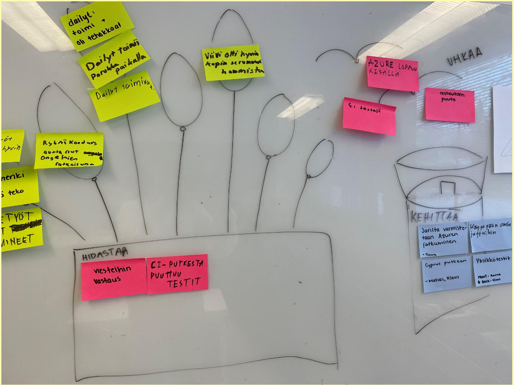

# Team 8 - Kasipallot

# Table of Contents
- [Team 8 - Kasipallot](#team-8---kasipallot)
- [Table of Contents](#table-of-contents)
  - [Project Review 1](#project-review-1)
    - [Product Vision](#product-vision)
    - [Product Backlog](#product-backlog)
    - [Sprint Backlog of the current Sprint](#sprint-backlog-of-the-current-sprint)
    - [Process Overview](#process-overview)
      - [Project schedule and effort](#project-schedule-and-effort)
      - [Recurring events of the Sprints](#recurring-events-of-the-sprints)
        - [Sprint Planning](#sprint-planning)
        - [Sprint Review](#sprint-review)
        - [Sprint Retrospective](#sprint-retrospective)
        - ["Daily” Scrums](#daily-scrums)
        - [Teamwork sessions](#teamwork-sessions)
        - [Testing and other quality assurance practices](#testing-and-other-quality-assurance-practices)
        - [Communication channel(s)](#communication-channels)
        - [Backlog management](#backlog-management)
        - [Time tracking](#time-tracking)
        - [Version control](#version-control)
    - [Definition of Done](#definition-of-done)
    - [Technical overview](#technical-overview)
  - [Project Review 2](#project-review-2)
    - [Product Vision](#product-vision-1)
    - [Product Backlog](#product-backlog-1)
    - [Sprint 2 backlog](#sprint-2-backlog)
    - [Sprint 3 backlog](#sprint-3-backlog)
    - [Sprint 4 backlog](#sprint-4-backlog)
    - [Velocity Chart](#velocity-chart)
    - [Process Overview](#process-overview-1)
      - [Project schedule and effort](#project-schedule-and-effort-1)
      - [Recurring events of the Sprints](#recurring-events-of-the-sprints-1)
        - [Sprint Planning](#sprint-planning-1)
        - [Sprint Review](#sprint-review-1)
        - [Sprint Retrospective](#sprint-retrospective-1)
        - ["Daily” Scrums](#daily-scrums-1)
        - [Teamwork sessions](#teamwork-sessions-1)
        - [Testing and other quality assurance practices](#testing-and-other-quality-assurance-practices-1)
        - [Communication channel(s)](#communication-channels-1)
        - [Backlog management](#backlog-management-1)
        - [Time tracking](#time-tracking-1)
        - [Version control](#version-control-1)
    - [Links to the software](#links-to-the-software)
    - [Definition of Done](#definition-of-done-1)
    - [Technical overview](#technical-overview-1)
  - [Project Review 3](#project-review-3)
    - [Product Vision](#product-vision-2)
    - [Product Backlog](#product-backlog-2)
    - [Sprint 5 backlog](#sprint-5-backlog)
    - [Sprint 6 backlog](#sprint-6-backlog)
    - [Velocity Chart](#velocity-chart-1)
    - [Process Overview](#process-overview-2)
      - [Project schedule and effort](#project-schedule-and-effort-2)
      - [Recurring events of the Sprints](#recurring-events-of-the-sprints-2)
        - [Sprint Planning](#sprint-planning-2)
        - [Sprint Review](#sprint-review-2)
        - [Sprint Retrospective](#sprint-retrospective-2)
        - ["Daily” Scrums](#daily-scrums-2)
        - [Teamwork sessions](#teamwork-sessions-2)
        - [Testing and other quality assurance practices](#testing-and-other-quality-assurance-practices-2)
        - [Communication channel(s)](#communication-channels-2)
        - [Backlog management](#backlog-management-2)
        - [Time tracking](#time-tracking-2)
        - [Version control](#version-control-2)
    - [Links to the software](#links-to-the-software-1)
    - [Definition of Done](#definition-of-done-2)
    - [Technical overview](#technical-overview-2)
    - [Test session charters and logs](#test-session-charters-and-logs)
      - [Testattavat alueet (https://futuboard.live/)](#testattavat-alueet-httpsfutuboardlive)
      - [Tavoitteet](#tavoitteet)
      - [Testauksen toteutus](#testauksen-toteutus)
      - [Testaus tiedot](#testaus-tiedot)
      - [Testauksen tulokset](#testauksen-tulokset)

## Project Review 1

Contents for Project Review 1

### Product Vision

- Our goal is to make a free, easy to use and open source web tool for managing team workflows.
- The tool will include all the necessary features required for an individual or a team to easily manage workflows without suffering from having too many features.
    - Efficiently implement a team collaboration platform, facilitating remote and mobile accessibility, while integrating software-based reporting for streamlined functionality of a team wall.
- This tool will allow for more efficient work in teams where all the members are not frequently in the same room.
- Team members can also remotely access the teams board.
- Allows teams to automatically generate visualizations and statistics of how their work is progressing.
 - An easier to use alternative to other agile tools with all the required features.

### Product Backlog

### Sprint Backlog of the current Sprint

### Process Overview

#### Project schedule and effort

#### Recurring events of the Sprints

##### Sprint Planning

- When: At the start of the sprint. Same day as sprint review and retrospective. We have been combining Sprint planning, review and retrospective. Actual schedule depends on the PO and dev team schedules.
- Organizer: Scrum master
- Participants: Scrum team
- Results: Sprint backlog is decided.

##### Sprint Review

- When: Same day as sprint planning and retrospective.
- Organizer: Scrum master
- Participants: Scrum team
- Results: PO is up-to-date how sprint goal has succeeded.

##### Sprint Retrospective

- When: Same day as sprint planning and retrospective.
- Organizer: Scrum master
. Participants: Scrum team
- Results: We know what is going well and decided on improvements.

##### "Daily” Scrums

- When: We have a live daily every Monday at 16:00. Remote daily is held on Fridays at 9:00 when needed.
- Organizer: Scrum master
- Participants: Developers
- Results: The team will be updated on the current situation of the sprint and reacts accrodingly.

##### Teamwork sessions

- When: Dev team usually holds teamwork sessions on Wednesdays or Thursdays if needed.
- Organizer: Developers
- Participants: Developers
- Results: Tasks are performed together and progress on tasks.

##### Testing and other quality assurance practices

Not yet defined.

##### Communication channel(s)

- Telegram for the dev team
- Whatsapp for the whole scrum team

##### Backlog management

- Miro

##### Time tracking

- Excel in Google Drive

##### Version control

Git repostiory in Github [https://github.com/Kasipallot/Futuboard]()

### Definition of Done

- The expected value of the user story has been fulfilled
- Acceptance criteria have been met or deemed unnecessary
- The work has been reviewed and approved by someone other than the primary contributor
- Work reporting, with consideration for Sprint Review, has been prepared
- (For code) The work output is in version control, passes the CI+TA system, tested successfully in the system environment, and available for trial in the testing environment
- All essential documentation has been updated (including this Miro board)
- Notification of completion has been sent to all parties needing the information

### Technical overview

## Project Review 2

Contents for Project Review 2

### Product Vision

- Our goal is to make a free, easy to use and open source web tool for managing team workflows.
- The tool will include all the necessary features required for an individual or a team to easily manage workflows without suffering from having too many features.
    - Efficiently implement a team collaboration platform, facilitating remote and mobile accessibility, while integrating software-based reporting for streamlined functionality of a team wall.
- This tool will allow for more efficient work in teams where all the members are not frequently in the same room.
- Team members can also remotely access the teams board.
- Allows teams to automatically generate visualizations and statistics of how their work is progressing.
 - An easier to use alternative to other agile tools with all the required features.

### Product Backlog

### Sprint 2 backlog

### Sprint 3 backlog

### Sprint 4 backlog

### Velocity Chart

### Process Overview

#### Project schedule and effort

#### Recurring events of the Sprints

##### Sprint Planning

- When: At the start of the sprint. Same day as sprint review and retrospective. We have been combining Sprint planning, review and retrospective. Actual schedule depends on the PO and dev team schedules.
- Organizer: Scrum team
- Participants: Scrum team
- Results: Sprint backlog is decided.

##### Sprint Review

- When: Same day as sprint planning and retrospective.
- Organizer: Scrum team
- Participants: Scrum team
- Results: PO is up-to-date how sprint goal has succeeded.

##### Sprint Retrospective

- When: Same day as sprint planning and retrospective.
- Organizer: Scrum team
. Participants: Scrum team
- Results: We know what is going well and decided on improvements.

##### "Daily” Scrums

- When: We have a remote daily every Wednesday at 16:00. Remote daily is held on Thursdays at 16:00 when needed.
- Organizer: Scrum team
- Participants: Developers
- Results: The team will be updated on the current situation of the sprint and reacts accrodingly.

##### Teamwork sessions

- When: Dev team usually holds teamwork sessions on Wednesdays or other days if needed.
- Organizer: Developers
- Participants: Developers
- Results: Tasks are performed together and progress on tasks.

##### Testing and other quality assurance practices

Performance:
- Operation for less than 100 stickies must be immediate.
- At least 10 simultaneous users and boards must be smooth.

User experience:
- Fast, convenient, and reliable user experience is the key to value with this tool. We want to make using this as handy as possible, otherwise users will get frustrated instead of delighted.
- The use should be intuitive to user. 
- Must feel simple to use.

Business support:
1. Promo text of project origin (for example About Us page) that encourages use and further development of tool.
2. Promoting the original creators for fame and glory. The user should be able to find the original creators.

Security:
This is a low priority aspect of quality for this system
1. There will be two passwords for each board:
   - One which enables user to make changes.
   - One which enables user to only view the board.

Functionality:
1. Create and Customize:
   - Create boards and stickies with titles.
   - Define states, set sizes, and assign colors for stickies.
2. Organize and Track:
   - Refine stories conveniently and move stickies between states.
   - Define swimlanes and set WIP limits for better organization.
   - Track team members, tasks, and changes made to stickies.
3. Access Anywhere:
   - Access the system seamlessly from laptops and phones.
4. Ownership and Collaboration:
   - Assign owners to stickies and indicate who is working on the sticky.
   - Foster communication through comments and other board functionality.
5. Estimation and Visualization:
   - Visualize progress through color-coded stickies.
   - The tool generates basic project follow-up charts for the user.

Interoperability:
1. Layers of GUI, business logic, and data storage should be separated by clear APIs to enable future configurations of different implementations for each layer.
2. Must be usable from Chrome (desktop and mobile).
3. Should be deployable to work in public and private networks with priority on public cloud

Reliability:
1. System should not lose data in the event of an error
2. System should automatically restart in case of an error (watchdog or GUI triggered restart..)
3. Mean time between user observable errors is more than a week.

Supportability:
1. System is to be implemented with modern cloud methods that enable trivial deployment and managing the entire system configuration as code in version control.

Testability:
1. Must be able to do end-to-end testing using Cypress.

##### Communication channel(s)

- Telegram for the dev team (with different channels)
- Whatsapp for the whole scrum team

##### Backlog management

- Miro

##### Time tracking

- Excel in Google Drive

##### Version control

Git repostiory in Github [https://github.com/Kasipallot/Futuboard]()

### Links to the software

Main: [https://white-ocean-04e4e8003.4.azurestaticapps.net]()
Backend: [https://futuboardbackend.azurewebsites.net]()

Development: [https://ashy-sea-0c7c52603.4.azurestaticapps.net]()
Backend: [https://futuboardbackenddev.azurewebsites.net]()

### Definition of Done

- The expected value of the user story has been fulfilled
- Acceptance criteria have been met or deemed unnecessary
- The work has been reviewed and approved by someone other than the primary contributor
- Work reporting, with consideration for Sprint Review, has been prepared
- (For code) The work output is in version control, passes the CI+TA system, tested successfully in the system environment, and available for trial in the testing environment
- All essential documentation has been updated (including this Miro board)
- Notification of completion has been sent to all parties needing the information

### Technical overview

## Project Review 3

Contents for Project Review 3

### Product Vision

- Our goal is to make a free, easy to use and open source web tool for managing team workflows.
- The tool will include all the necessary features required for an individual or a team to easily manage workflows without suffering from having too many features.
    - Efficiently implement a team collaboration platform, facilitating remote and mobile accessibility, while integrating software-based reporting for streamlined functionality of a team wall.
- This tool will allow for more efficient work in teams where all the members are not frequently in the same room.
- Team members can also remotely access the teams board.
- Allows teams to automatically generate visualizations and statistics of how their work is progressing.
 - An easier to use alternative to other agile tools with all the required features.

### Product Backlog

### Sprint 5 backlog

### Sprint 6 backlog

     

### Velocity Chart
                    

### Process Overview

#### Project schedule and effort

                   
     

#### Recurring events of the Sprints

##### Sprint Planning

- When: At the start of the sprint. Same day as sprint review and retrospective. We have been combining Sprint planning, review and retrospective. Actual schedule depends on the PO and dev team schedules.
- Organizer: Scrum team
- Participants: Scrum team
- Results: Sprint backlog is decided.

##### Sprint Review

- When: Same day as sprint planning and retrospective.
- Organizer: Scrum team
- Participants: Scrum team
- Results: PO is up-to-date how sprint goal has succeeded.

##### Sprint Retrospective

- When: Same day as sprint planning and retrospective.
- Organizer: Scrum team
. Participants: Scrum team
- Results: We know what is going well and decided on improvements.

           

##### "Daily” Scrums

- When: We have a remote daily every Wednesday at 16:00. Remote daily is held on Thursdays at 16:00 when needed.
- Organizer: Scrum team
- Participants: Developers
- Results: The team will be updated on the current situation of the sprint and reacts accrodingly.

##### Teamwork sessions

- When: Dev team usually holds teamwork sessions on Wednesdays or other days if needed.
- Organizer: Developers
- Participants: Developers
- Results: Tasks are performed together and progress on tasks.

##### Testing and other quality assurance practices

Performance:
- Operation for less than 100 stickies must be immediate.
- At least 10 simultaneous users and boards must be smooth.

User experience:
- Fast, convenient, and reliable user experience is the key to value with this tool. We want to make using this as handy as possible, otherwise users will get frustrated instead of delighted.
- The use should be intuitive to user. 
- Must feel simple to use.

Business support:
1. Promo text of project origin (for example About Us page) that encourages use and further development of tool.
2. Promoting the original creators for fame and glory. The user should be able to find the original creators.

Security:
This is a low priority aspect of quality for this system
1. There will be two passwords for each board:
   - One which enables user to make changes.
   - One which enables user to only view the board.

Functionality:
1. Create and Customize:
   - Create boards and stickies with titles.
   - Define states, set sizes, and assign colors for stickies.
2. Organize and Track:
   - Refine stories conveniently and move stickies between states.
   - Define swimlanes and set WIP limits for better organization.
   - Track team members, tasks, and changes made to stickies.
3. Access Anywhere:
   - Access the system seamlessly from laptops and phones.
4. Ownership and Collaboration:
   - Assign owners to stickies and indicate who is working on the sticky.
   - Foster communication through comments and other board functionality.
5. Estimation and Visualization:
   - Visualize progress through color-coded stickies.
   - The tool generates basic project follow-up charts for the user.

Interoperability:
1. Layers of GUI, business logic, and data storage should be separated by clear APIs to enable future configurations of different implementations for each layer.
2. Must be usable from Chrome (desktop and mobile).
3. Should be deployable to work in public and private networks with priority on public cloud

Reliability:
1. System should not lose data in the event of an error
2. System should automatically restart in case of an error (watchdog or GUI triggered restart..)
3. Mean time between user observable errors is more than a week.

Supportability:
1. System is to be implemented with modern cloud methods that enable trivial deployment and managing the entire system configuration as code in version control.

Testability:
1. Must be able to do end-to-end testing using Cypress.

##### Communication channel(s)

- Telegram for the dev team (with different channels)
- Whatsapp for the whole scrum team

##### Backlog management

- Futuboard ([https://futuboard.live/board/4222b03a-24b3-4bac-b5dd-49a044910767]())

##### Time tracking

- Excel in Google Drive

##### Version control

Git repostiory in Github [https://github.com/Kasipallot/Futuboard]()

### Links to the software

Production/Main: [https://futuboard.live]() ([https://white-ocean-04e4e8003.4.azurestaticapps.net]())
Backend: [https://futuboardbackend.azurewebsites.net]()

Development: [https://ashy-sea-0c7c52603.4.azurestaticapps.net]()
Backend: [https://futuboardbackenddev.azurewebsites.net]()

### Definition of Done

- The expected value of the user story has been fulfilled
- Acceptance criteria have been met or deemed unnecessary
- The work has been reviewed and approved by someone other than the primary contributor
- Work reporting, with consideration for Sprint Review, has been prepared
- (For code) The work output is in version control, passes the CI+TA system, tested successfully in the system environment, and available for trial in the testing environment
- All essential documentation has been updated (including this Miro board)
- Notification of completion has been sent to all parties needing the information

### Technical overview

### Test session charters and logs

   #### Testattavat alueet (https://futuboard.live/)
   Toivomme, että Futuboardin kaikkia toiminnallisuuksia testattaisiin. Kaikki Futuboardin toiminnallisuudet ovat suhteellisen yksinkertaisia. Haluaisimme kuitenkin erityisesti, että Swimlanejen toiminnallisuutta testataan. 
   
   Emme halua kertoa miten mitäkin tehdään, koska haluamme myös nähdä onko työkalun käyttö intuitiivista. 

   #### Tavoitteet
   Haluaisimme saada ymmärrystä, miten Futuboard toimii tavallisten käyttäjien projektinhallintatyökaluna. Tärkeää olisi myös saada tietoon mahdolliset bugit, jotka tulevat ilmi ja kuinka paljon ne haittaavat käyttökokemusta. Haluaisimme myös tietää miten hyvin Futuboard toimii tiimi työskentelyssä, jos samaa taulua käyttää useampi käyttäjä yhtä aikaa. 

   Tärkeää olisi myös testata Swimlaneja. Haluaisimme palautetta näiden toiminnasta ja miten testaaja ymmärtää niiden käytön. 

   #### Testauksen toteutus
   Testauksessa käytetään testaajan/testaajien itse luomia taulua ja tehdään niihin muutoksia. Mitään erityisiä testaus tapoja ei toivota, vaan haluisimme, että käytätte sovellusta normaalin käyttäjän tavoin. Olisi hyvä, jos testausta toteutetaan useassa sessiossa, jotta datan lataamista ja tallentamista tulisi testattua paljon.

   #### Testaus tiedot
   Sessio 1:
   - Session aloitusaika: 19.03.2024 
   - Kesto: 2h
   - Testaaja: Aleksi Puttonen
   - Taulun linkki: [https://futuboard.live/board/6eaf62c6-b388-4beb-b121-a1c4b2d6c9aa]()
   - Selain: Safari
   
   Sessio 2:
   - Session aloitusaika: 20.03.2024 14.04
   - Kesto: 3h
   - Testaaja: Laurens van der Helm
   - Taulun linkki: [https://futuboard.live/board/ee7c1fd0-d285-4657-bae6-a2cdc25d826e]()
   - Selain: Chrome
   
   Sessio 3:
   - Session aloitusaika: 24.3.2024 12.15
   - Kesto: 1h
   - Testaaja: Eemi Kärkkäinen
   - Taulun linkki: [https://futuboard.live/board/debedaf0-5998-40f7-8011-8cbb2fe0c042]()
   - Selain: Chrome
   
   Sessio 4:
   - Session aloitusaika: 24.03.2024 14.20 
   - Kesto: 1h
   - Testaaja: Henrik Rouhesmaa
   - Taulun linkki: [https://futuboard.live/board/a84f6d6e-1656-4b30-856e-f4a83fbf35dd]()
   - Selain: Chrome

   Sessio 5:
   - Session aloitusaika: 24.03.2024 21:30
   - Kesto: 1h
   - Testaaja: Benjamin Hadaya
   - Taulun linkki: [https://futuboard.live/board/c3b78b37-3615-4b78-b2cc-ee3dc9ccd606]()
   - Selain: Safari

   #### Testauksen tulokset 
   - Password field toiminnallisuus olisi hyvä: olemme todenneet, että se on hyvä että salasana näkyy, haluammeko että salasana on piilossa, mutta halutessa näkyvillä
   - kaksi input fieldiä: että käyttäjä joutuu varmistamaan kirjoittamansa salasanan
   - loading animaatio: Joku spinneri voisi olla hyvä kun luo uuden taulun, nyt se jää hetkeksi miettimään aloitusruutuun, ennen kuin tapahtuu mitään.
   - Salasanan kysyntä heti: Kun luon uuden taulun, miksi kysytään heti uudestaan salasana tauluun? Voisiko tuon rakentaa siten, että kun luo taulun, pääsee heti käsiksi siihen?
      - Voisiko jonkun tokenin tmv tallentaa selaimen localstorageen, ettei appi kirjaisi boardista ulos jos sivun päivittää?
   - WIP arvoille labelit: Kun uuden kortin on luonut, size-yksikölle voisi mielestäni olla joku label, ettei cardissa olisi pelkkä numero. Sama kolumneille.
   - Taulun nimen muuttaminen jälkeenpäin voisi olla mielekästä
   - Nimi järjestyksen muuttaminen: Käyttäjien järjestys muuttuu nimeä raahatessa, mutta palautuu ennalleen irti päästäessä. Nimi järjestyksen muuttaminen olisi kiva feature
   - Etusivulta pystyisi myös liittymään tauluihin (esim nimen perusteella?). Nyt jos hukkaat taulun linkin, siihen ei pääse mitenkään käsiksi.  (Hankala, voi olla saman nimisiä tauluja)
   - Korteille joku prioriteetti: korteille ja korttien actioneille jonkinlainen prioriteetti, aikataulutus/deadline? Voisi myös sortata tai filteröidä näiden mukaan. Tiketteihin olisi mukava luoda prioriteetti (low, medium, high, urgent) ja kenties järjestää ne sen mukaan. Olisi kiva myös pystyä pistämään deadline (päivämäärä).
   - Kolumni scrollaus: Kun columniin luo monta tikettiä, olisi mielestäni parempi että tikettilistaa voisi scrollata sen sijaan, että column vain pitenee.
   - Actionin poistaminen: Swimlanessa ei pysty mitenkään poistamaan actioneita. Esim. jos tekee kirjoitusvirheen
   - Komponenttien yhtä aikainen muokkaus: Kun useampi käyttäjä työskentelee boardilla samanaikaisesti, on mahdollista yliajaa toisen tekemät muutokset. Tämän voisi rajoittaa jotenkin niin, että vain yksi käyttäjä saa muokata yhtä komponenttia samanaikaisesti.
   - Swimlane: Nuoli voisi kääntyä riippuen onko swimlanet auki vai kiinni (ks kuvat alla) + Swimlaneja ei voi luoda sen jälkeen, kun columnin on jo luonut
   

