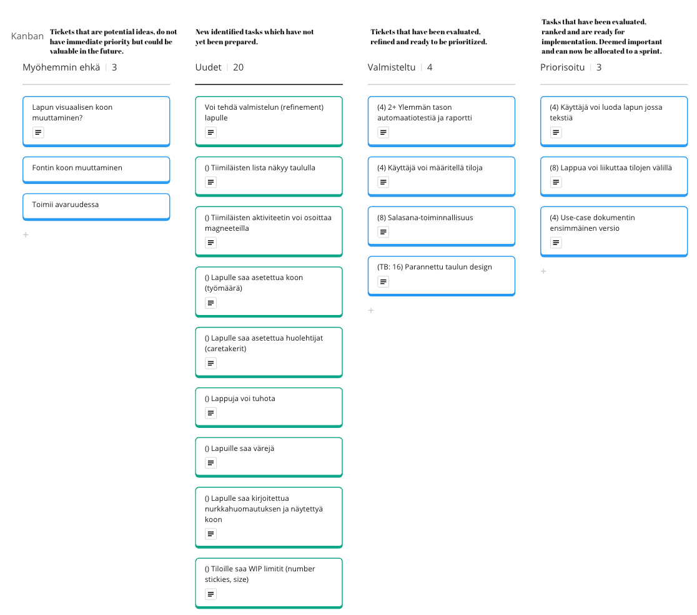

# Team 8 - Kasipallot

## Project Review 1

Contents for Project Review 1

### Product Vision

- Our goal is to make a free, easy to use and open source web tool for managing team workflows.
- The tool will include all the necessary features required for an individual or a team to easily manage workflows without suffering from having too many features.
    - Efficiently implement a team collaboration platform, facilitating remote and mobile accessibility, while integrating software-based reporting for streamlined functionality of a team wall.
- This tool will allow for more efficient work in teams where all the members are not frequently in the same room.
- Team members can also remotely access the teams board.
- Allows teams to automatically generate visualizations and statistics of how their work is progressing.
 - An easier to use alternative to other agile tools with all the required features.

### Product Backlog

### Sprint Backlog of the current Sprint

### Process Overview

#### Project schedule and effort

#### Recurring events of the Sprints

##### Sprint Planning

When: At the start of the sprint. Same day as sprint review and retrospective. We have been combining Sprint planning, review and retrospective. Actual schedule depends on the PO and dev team schedules.
Organizer: Scrum master
Participants: Scrum team
Results: Sprint backlog is decided.

##### Sprint Review

When: Same day as sprint planning and retrospective.
Organizer: Scrum master
Participants: Scrum team
Results: PO is up-to-date how sprint goal has succeeded.

##### Sprint Retrospective

When: Same day as sprint planning and retrospective.
Organizer: Scrum master
Participants: Scrum team
Results: We know what is going well and decided on improvements.

##### "Daily” Scrums

When: We have a live daily every Monday at 16:00. Remote daily is held on Fridays at 9:00 when needed.
Organizer: Scrum master
Participants: Developers
Results: The team will be updated on the current situation of the sprint and reacts accrodingly.

##### Teamwork sessions

When: Dev team usually holds teamwork sessions on Wednesdays or Thursdays if needed.
Organizer: Developers
Participants: Developers
Results: Tasks are performed together and progress on tasks.

##### Testing and other quality assurance practices

Not yet defined.

##### Communication channel(s)

- Telegram for the dev team
- Whatsapp for the whole scrum team

##### Backlog management

- Miro

##### Time tracking

- Excel in Google Drive

##### Version control

Git repostiory in Github [https://github.com/Kasipallot/Futuboard]()

### Definition of Done

- The expected value of the user story has been fulfilled
- Acceptance criteria have been met or deemed unnecessary
- The work has been reviewed and approved by someone other than the primary contributor
- Work reporting, with consideration for Sprint Review, has been prepared
- (For code) The work output is in version control, passes the CI+TA system, tested successfully in the system environment, and available for trial in the testing environment
- All essential documentation has been updated (including this Miro board)
- Notification of completion has been sent to all parties needing the information

### Technical overview

